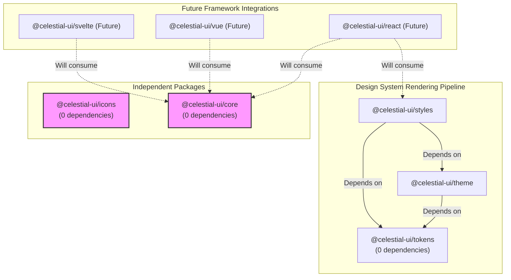

# Architecture for Consumers

The Celestial UI Foundation is designed around a core principle: **Composability without lock-in.**

You are not required to adopt the entire ecosystem. The architecture allows you to consume exactly what you need, from raw design tokens to framework-agnostic behavioral contracts.

## The Dependency Graph

This diagram illustrates the actual package dependencies. An arrow from A to B means A depends on B.

## Architectural Tenets

### 1. Zero-Dependency Core
`@celestial-ui/core` is the heart of the behavioral logic, providing semantic component contracts, accessibility management, and state logic. It is completely independent. It does **not** rely on `tokens`, `theme`, or `styles`. You can use it to build your own custom React/Vue/Svelte components using your own design system.

### 2. Independent Icon System
`@celestial-ui/icons` is a provider-neutral registry. It does not depend on any other Celestial packages. You bring your own icon library (like Lucide or Phosphor) as a peer dependency, and this package provides the resolution engine.

### 3. Progressive Styling
The visual design system is split into three layers:
1. **Tokens:** Raw data (colors, spacing, typography). Completely independent.
2. **Theme:** Organizes tokens into modes (dark/light) and profiles. Depends on Tokens.
3. **Styles:** Compiles themes into deliverable CSS. Depends on Theme and Tokens.

You can stop at any layer. If you use Tailwind, you might only need `tokens`. If you have a custom CSS-in-JS solution, you might only need `theme` and `tokens`.

### 4. Framework Agnostic First
All five foundation packages are framework-agnostic. They work in plain JavaScript/TypeScript, React, Vue, Svelte, or Angular. 

The official framework bindings (e.g., `@celestial-ui/react`) are an *optional* top-level layer (currently in development) that wrap the foundation for convenience. They are not required to use Celestial UI.
