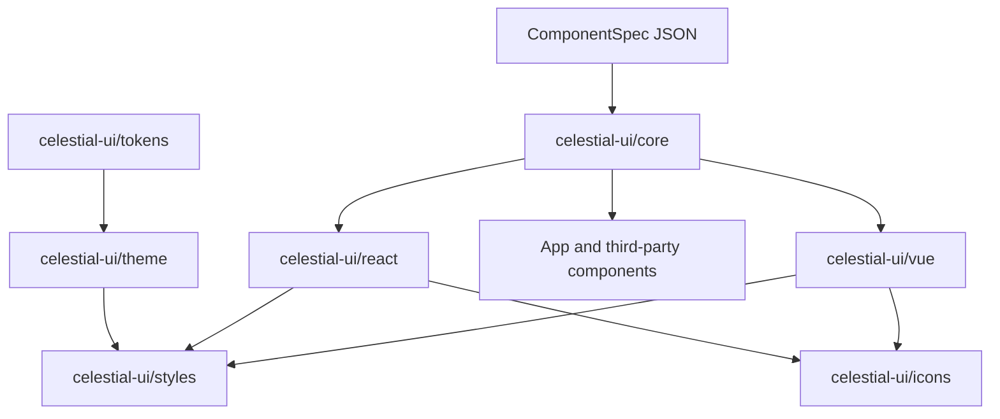

# @celestial-ui/core V1 Implementation Plan

This is the planning artifact for Core. After approval, implementation should write the same content to [`packages/core/CORE_IMPLEMENTATION_PLAN.md`](packages/core/CORE_IMPLEMENTATION_PLAN.md) (or `docs/`) as the first commit of Phase 0. **No production code, package, or frozen-package change is in this planning step.**

---

## 1. Executive Summary

`@celestial-ui/core` is the **public, framework-agnostic behavioral and contractual foundation** of Celestial UI. It is consumed by official adapters (`react` / `vue`, later others), application-specific components, and third-party Celestial-compatible components.

Frozen packages already own visuals and delivery:

- [`@celestial-ui/tokens`](packages/tokens) — canonical tokens
- [`@celestial-ui/theme`](packages/theme) — theme/tenant resolution
- [`@celestial-ui/styles`](packages/styles) — CSS compiler/runtime/SSR (`data-cui-theme`, `data-cui-mode`, …)
- [`@celestial-ui/icons`](packages/icons) — icon resolution (not rendering)

**Core must not re-implement those domains.** Runtime dependency on them is **not required** (see §6). Core owns contracts, specs, controllers, accessibility _semantics_, collections, overlay _behavior_, runtime/plugins, environment, diagnostics, and contract-testing utilities.

The adapter boundary is:



---

## 2. Scope Lock (V1)

Core V1 owns exactly these domains (locked):

1. Component contracts
2. ComponentSpec / metadata
3. Props contracts
4. State and behavior
5. Interaction
6. Accessibility semantics
7. Slots / parts / composition
8. Collections and selection
9. Form-field contract
10. Overlay behavior
11. Runtime / configuration
12. Plugin system
13. Directionality
14. Environment / SSR abstractions
15. Framework-neutral component utilities (narrow; not a lodash package)
16. Contract testing utilities
17. Naming conventions
18. DOM/data-attribute conventions
19. DOM prop-forwarding contract
20. Ref / element-exposure contract
21. Polymorphism contract (`as` only)
22. Error / warning convention
23. Localization / content contract
24. Framework adapter boundary

---

## 3. Explicit Non-Goals

- React/Vue/Svelte/Solid/Web Component rendering, hooks, composables, JSX, templates, lifecycle APIs
- CSS generation, token catalogs, theme resolution, icon providers
- Validation engines (Zod/Yup/Valibot/RHF/VeeValidate) or a Celestial i18n engine
- Business logic, data fetching, app state stores
- DOM overlay libraries (Floating UI, portals that create nodes)
- `asChild` (unless separately approved)
- Official Button/Input/Dialog implementations
- New packages (`hooks`, `composables`, `utils`, `behavior`, `i18n`)
- Documentation/codegen _products_ (explorer, AI gen) — only architecture that keeps them possible
- Changing frozen packages unless a blocking incompatibility is found (none found)

---

## 4. Core Architectural Principles

1. **Contracts are data; behavior is controllers.** Specs serialize. Controllers do not live inside JSON.
2. **Instance over process global.** Icons already warn that `configureCelestialIcons()` leaks across SSR requests. Core runtime is **created**, never a hidden process singleton for per-request state.
3. **Environment is injected.** Match styles’ `createThemeStyleManager({ document })`. No `window`/`document` at module evaluation.
4. **Adapters render; Core describes.** Accessibility maps, attribute builders, and keyboard tables are Core; applying them is the adapter.
5. **Public and third-party first.** APIs must work without importing `@celestial-ui/react`.
6. **Tree-shake by capability subpath.** Root is curated; internals stay unexported.
7. **Tenant/app isolation.** Runtime instances do not share plugin tables, overlay stacks, or id sequences across apps/requests.
8. **No generic utility dump.** A helper lands only if a locked domain needs it.
9. **Align with repo conventions:** CJS `tsc`, colocated Vitest, structured errors, schema vs package version, `data-cui-*`, `files: ["dist"]`, framework-agnostic release gate (copy [`packages/styles/src/framework-agnostic.test.ts`](packages/styles/src/framework-agnostic.test.ts)).

**Assumptions:** Node >= 22, pnpm workspaces, Turbo `^build`, Changesets, TypeScript strict. No Nx requirement for Core.

---

## 5. Dependency Graph

```text
@celestial-ui/tokens
        │
        ▼
@celestial-ui/theme
        │
        ▼
@celestial-ui/styles     @celestial-ui/icons   (siblings)

        ╲                      ╱
         ╲                    ╱     (NO runtime edge into Core)
          ▼                  ▼
              @celestial-ui/core     ← zero workspace runtime deps

                      │
          ┌───────────┼───────────┐
          ▼           ▼           ▼
   @celestial-ui/react   vue    app / third-party
```

No cycles. Core never depends on React/Vue/validation/i18n.

---

## 6. Package Dependency Decisions

| Dependency                                              | Decision                 | Reason                                                                                                                                     |
| ------------------------------------------------------- | ------------------------ | ------------------------------------------------------------------------------------------------------------------------------------------ |
| `@celestial-ui/tokens`                                  | **None** (not even peer) | Tokens are visual values. Core variant/size names are _semantic_, mapped by adapters to CSS/`--cui-*`. Avoid coupling Core to token graph. |
| `@celestial-ui/theme`                                   | **None**                 | Theme slots (`brand`, `surface`, …) are token-governance slots, not component slots.                                                       |
| `@celestial-ui/styles`                                  | **None**                 | CSS/runtime/SSR style tags stay in styles. Core may _document_ reserved `data-cui-*` names so they do not collide.                         |
| `@celestial-ui/icons`                                   | **None**                 | Core may declare a slot `leadingIcon`; payload/resolution stays in icons + adapters.                                                       |
| React/Vue/Zod/i18n                                      | **Forbidden**            | Locked.                                                                                                                                    |
| Runtime npm deps                                        | **None in V1**           | Controllers are small TypeScript. No XState, no Floating UI.                                                                               |
| Dev: `vitest`, `typescript`, `@types/node`, `happy-dom` | **Yes**                  | Match styles for DOM/env tests; node env for spec/contract tests.                                                                          |

**No architecture exception for extra packages.**

**Naming collision (document, do not change theme):** Theme `ThemeSlot` ≠ Core `ComponentSlot`. Always prefix in public types.

---

## 7. Complete Module Map

Every folder has one job. Do not add empty “nice architecture” folders.

```text
packages/core/
  package.json
  tsconfig.json
  vitest.config.ts
  README.md
  CORE_IMPLEMENTATION_PLAN.md   # after approval
  src/
    index.ts                    # curated root
    version.ts
    ids.ts                      # ComponentId, plugin id, kebab validation
    diagnostics/
    environment/
    directionality/
    naming/                     # DOM attrs, part/slot names
    contracts/                  # ComponentContract types + validate
    spec/                       # ComponentSpec, metadata, defaults, serialize
    props/
    state/
    events/
    slots/                      # slots vs parts vs composition
    accessibility/
    behavior/                   # controllable, disclosure, activation, dismissal
    interaction/                # keyboard tables, pointer, typeahead
    collection/
    forms/
    overlay/
    runtime/
    plugins/
    polymorphism/
    forwarding/
    refs/
    localization/
    adapter/                    # FrameworkAdapter contract (types only)
    testing/                    # NOT exported from root
    internals/                  # @internal, not in any public export
```

Public entry files (not the whole tree): `src/index.ts` plus `src/*-entry.ts` or `src/exports/*.ts` mapped in `package.json` `exports`.

---

## 8. Public API Design

**Root (`@celestial-ui/core`)** — curated, stable, no testing helpers:

- Versions: `CORE_PACKAGE_VERSION`, `CONTRACT_SCHEMA_VERSION`, `SPEC_SCHEMA_VERSION`, `PLUGIN_CONTRACT_VERSION`
- Types: `ComponentContract`, `ComponentSpec`, `ComponentId`, state/event/slot/part/a11y/form/overlay/runtime/plugin types
- Factories: `defineComponentSpec()`, `validateComponentSpec()`, `validateComponentContract()`
- State: `COMPONENT_STATES`, `createStateSet()`, `serializeStates()`, `statesToDomAttributes()`
- Behavior: `createControllableState()`, `createDisclosure()`, `createSelection()`, `createCollection()`, `createFocusManager()`, `createRovingFocus()`, `createTypeahead()`, `createOverlayController()`
- Runtime: `createCelestialRuntime()`, `createEnvironment()`
- DOM: `CUI_ATTRIBUTES`, `buildPartAttributes()`, `mergeForwardedProps()` (pure merge rules, no DOM)
- Diagnostics: `coreError()`, `CoreContractError`, `CoreRuntimeError`
- Direction: `Direction`, `getLogicalKeyMap()`
- Polymorphism: `resolvePolymorphicTag()`, `filterPropsForTag()` (tables, no JSX)

**Not on root:** testing matchers, internals, per-file paths.

Explicit named exports (follow [`packages/theme/src/index.ts`](packages/theme/src/index.ts) / icons), **not** `export *` from every folder.

---

## 9. Subpath Export Design

```json
"exports": {
  ".": { "types": "./dist/index.d.ts", "default": "./dist/index.js" },
  "./contracts": { "types": "./dist/exports/contracts.d.ts", "default": "./dist/exports/contracts.js" },
  "./behavior": { "...": "./dist/exports/behavior.js" },
  "./accessibility": { "...": "./dist/exports/accessibility.js" },
  "./collection": { "...": "./dist/exports/collection.js" },
  "./overlay": { "...": "./dist/exports/overlay.js" },
  "./runtime": { "...": "./dist/exports/runtime.js" },
  "./testing": { "types": "./dist/testing/index.d.ts", "default": "./dist/testing/index.js" }
}
```

Rules:

- Subpaths = capabilities, never `./src/foo`
- Root re-exports a **subset** of contracts/behavior/runtime (adapter convenience). Heavy overlay/collection can be imported from subpaths for tree-shaking
- `./testing` is **not** re-exported from `.`
- `files: ["dist"]` excluding `**/*.test.*`
- `sideEffects: false` except document that `./testing` is test-only

---

## 10. ComponentContract Design

Do **not** copy the prompt’s interface blindly. Production shape:

```ts
interface ComponentContract {
  id: ComponentId; // kebab-case, branded string, e.g. "button"
  version: string; // this component contract semver
  schemaVersion: string; // CONTRACT_SCHEMA_VERSION this was authored against

  props?: PropsContract;
  states?: StatesContract;
  variants?: VariantsContract;

  slots?: SlotsContract;
  parts?: PartsContract;

  events?: EventsContract;
  accessibility?: AccessibilityContract;
  behavior?: BehaviorContract; // declarative flags + required primitives
  composition?: CompositionContract;
  controlled?: ControlledStateContract;

  polymorphism?: PolymorphismContract;
  refs?: RefContract;
  localization?: LocalizationKeysContract; // key names only, no English copy
  formField?: FormFieldContract; // present only if the component is a field
  overlay?: OverlayContract; // present only if overlay-backed
}
```

**Required:** `id`, `version`, `schemaVersion`.  
**Optional:** everything else — not every component uses every domain.

**Validation rules:**

- `id` matches `/^[a-z][a-z0-9-]*$/` (same spirit as styles scope ids)
- `schemaVersion` major must match `CONTRACT_SCHEMA_VERSION` major (`isCatalogueCompatible` pattern from [`packages/icons/src/version.ts`](packages/icons/src/version.ts))
- Slot names ∩ part names may overlap (`trigger` as both) but must be declared in both maps if so
- Every `controlled` field must have a matching prop + event
- Accessibility `role` required if `behavior.requiresRole !== false` for interactive components
- No functions, class instances, or symbols in the contract object

**Versioning:** component `version` is the _component’s_ contract; `schemaVersion` is Core’s contract schema. Adapters declare `minCoreContractSchema`.

**Extensibility:** `extensions?: Record<string, unknown>` namespaced (`extensions['acme.analytics']`). Unknown keys in `extensions` are allowed; unknown top-level keys fail validation (closed object + explicit extensions bag).

**Serialization:** JSON. `defineComponentSpec` freezes (`Object.freeze` deep) after validate.

**Compatibility:** adding optional fields = minor; removing/renaming = major; tightening validation = major.

---

## 11. ComponentSpec Design

```ts
interface ComponentMetadata {
  displayName: string; // not used as a11y name
  description?: string; // docs only; not runtime a11y
  tags?: string[];
  status: "stable" | "preview" | "deprecated";
  owner?: string; // 'celestial' | tenant/app id string
}

interface ComponentDefaults {
  props?: Record<string, unknown>;
  variants?: Record<string, string>;
}

interface ComponentSpec {
  specSchemaVersion: string;
  contract: ComponentContract;
  metadata: ComponentMetadata;
  defaults?: ComponentDefaults;
}
```

Authoritative machine-readable definition. V1 ships **types + validate + freeze**, not a registry of all Celestial components (those land with react/vue).

Future docs/explorer/AI can consume serialized specs without Core growing a CMS.

---

## 12. Props Contract

```ts
interface PropDefinition {
  name: string; // camelCase public prop
  type: PropTypeDescriptor; // 'boolean' | 'string' | 'number' | 'enum' | 'unknown'
  enumValues?: string[];
  required?: boolean;
  default?: unknown;
  controlled?: boolean;
  description?: string; // docs
  mapsTo?: "state" | "variant" | "native" | "aria" | "slot" | "event";
}

interface PropsContract {
  props: Record<string, PropDefinition>;
  nativePassthrough?: "none" | "root" | "control";
}
```

No runtime prop validation library. Adapters enforce types via TS. `validateComponentContract` only checks _schema_ consistency (controlled props have events, enum nonempty, etc.).

---

## 13. State Model

**Representation:** kebab-case **string union**, not symbols (specs must serialize).

Canonical vocabulary (closed in V1; extensions via `extensions` or future minor add):

| State                           | Kind                                                                        | Payload                          | Typical DOM                                                                |
| ------------------------------- | --------------------------------------------------------------------------- | -------------------------------- | -------------------------------------------------------------------------- |
| `idle`                          | implicit default                                                            | no                               | omit                                                                       |
| `hover`                         | pointer                                                                     | no                               | `data-cui-state` token                                                     |
| `focus`                         | focus                                                                       | no                               | + native `:focus`                                                          |
| `focus-visible`                 | focus                                                                       | no                               | + `:focus-visible`                                                         |
| `active` / `pressed`            | **alias:** `pressed` is canonical; `active` deprecated synonym in docs only | no                               | token                                                                      |
| `selected`                      | boolean                                                                     | no                               | `aria-selected` when role requires                                         |
| `checked`                       | tri-state via payload `'true'\|'false'\|'mixed'`                            | yes                              | `aria-checked`                                                             |
| `expanded` / `collapsed`        | mutually exclusive disclosure                                               | no                               | `aria-expanded`                                                            |
| `disabled`                      | boolean                                                                     | no                               | `aria-disabled` and/or native `disabled`                                   |
| `readonly`                      | boolean                                                                     | no                               | `aria-readonly` / `readOnly`                                               |
| `loading`                       | boolean                                                                     | optional label _key_ not English | `aria-busy`                                                                |
| `invalid` / `valid`             | mutually exclusive when set                                                 | no                               | `aria-invalid`                                                             |
| `error` / `warning` / `success` | **status**, not exclusive with invalid                                      | no                               | `data-cui-state` + must pair with text/icon **in the component**, not Core |

**Simultaneous states:** `ReadonlySet<ComponentState>` plus `StatePayloads` map. Serialize `data-cui-state` as **space-separated sorted unique tokens** (CSS `[data-cui-state~="disabled"]`).

**Adapters:** subscribe to controller `getSnapshot()` / `subscribe(listener)`. Map set → attributes via `statesToDomAttributes()`.

**Validation:** spec lists _allowed_ states; runtime may only set allowed ones (dev warning otherwise).

Do **not** put `hover` in SSR snapshots; pointer/focus states are client-only.

---

## 14. Behavior Model

**Prefer controllers + explicit transition tables**, not XState (bundle weight, extra dep). Use a tiny internal machine **only** where illegal transitions are dangerous: overlay (open/closing/closed) and disclosure.

```ts
interface Controller<TSnapshot> {
  getSnapshot(): TSnapshot;
  subscribe(listener: () => void): () => void; // unsubscribe
  destroy(): void;
}
```

- **SSR-safe:** constructors do not touch DOM. Focus/overlay _commands_ no-op or queue if `environment.isBrowser === false`.
- **Controlled/uncontrolled:** `createControllableState({ value, defaultValue, onChange, isControlled })`. If controlled, ignore internal writes except notifying. Switching mode mid-life is a **dev warning** (React controlled-input lesson).
- **Cleanup:** `destroy()` unsubscribes, releases collection nodes, leaves overlay stack. Adapters call on unmount.
- **Adapters:** React `useSyncExternalStore(controller.subscribe, controller.getSnapshot)`; Vue `reactive`/`watch` wrapping snapshot; no Core Vue/React APIs.

Declarative `BehaviorContract` flags: `supportsDisabled`, `supportsLoading`, `openClosed`, `selectionMode: 'none'|'single'|'multiple'`, `requiredControllers: ['disclosure']`, etc. Runtime still uses factories; flags are for spec/docs/tests.

---

## 15. Interaction Model

Pure tables + controllers:

- **Keyboard:** `KeyboardIntent` (`next`, `prev`, `first`, `last`, `open`, `close`, `select`, `typeahead`). Direction-aware via §24.
- **Roving focus:** indices into collection; disabled items skipped; wrap optional.
- **Typeahead:** printable chars, timeout reset, locale-insensitive default (code unit); locale collator optional via runtime if provided by app.
- **Activation:** click / Enter / Space rules per role (button vs link vs option) in accessibility contract.
- **Pointer:** Core does not attach listeners. It exposes `shouldIgnorePointer(eventMeta)` for disabled/loading.
- **Ordering:** pointerdown → pressed; click → activate; keydown → intent → state → `onChange` sync. Events are **synchronous** unless overlay animation `closing` (adapter-driven). No promises in Core V1 APIs.

---

## 16. Accessibility Model

Split:

| Kind                   | In Core                                                                                                                                                                         | Not in Core                           |
| ---------------------- | ------------------------------------------------------------------------------------------------------------------------------------------------------------------------------- | ------------------------------------- |
| **A. Declarative**     | `role`, required name source (`label` \| `aria-label` \| `labelledby`), description ids, keyboard spec, focus spec, ARIA relationships (`controls`, `owns`, `activedescendant`) | English strings                       |
| **B. Behavioral util** | `createFocusTrap` _logic_ (tab cycle list supplied by adapter), `getFocusRestoreTarget`, `buildAriaProps(snapshot)`                                                             | calling `element.focus()` without env |
| **C. Adapter**         | Apply attributes, register real keydown, move DOM focus via `environment.focus(node)`                                                                                           | —                                     |

`AccessibilityContract` never embeds default English. `name.from: 'prop:ariaLabel' | 'slot:label' | 'contents'`. Missing name in **dev** = diagnostic; production = still emit what the adapter has.

Disabled: native `disabled` on form controls; `aria-disabled` on composite widgets that must remain focusable — spec flag `disabledFocusable`.

Focus containment/restoration: overlay controller records `previouslyFocusedId` via environment **before** open; restore on close unless `restoreFocus: false`.

---

## 17. Slots / Parts / Composition

**Slot:** named insertion point for _content_ (app or child component).  
**Part:** named _structure_ for styling, testing, behavior (always conceptually present).

Shared names (`trigger`, `error`) are allowed: slot = content; part = node.

Naming: camelCase in TS (`leadingIcon`); DOM `data-cui-part="leading-icon"` (kebab).

```ts
interface SlotDefinition {
  name: string;
  required?: boolean;
  description?: string;
}

interface PartDefinition {
  name: string;
  required: boolean;
  refTarget?: boolean;
  receivesNativeProps?: boolean;
}
```

Composition: `CompositionContract.allowedChildren?: ComponentId[]` optional; V1 does not enforce at runtime (no React children inspection). Contract tests later assert adapter structure.

**Do not call these theme slots.**

---

## 18. Events Contract

Semantic events, not `onClick`.

| Event            | Meaning                        | Payload                                     | Cancel                               | Sync |
| ---------------- | ------------------------------ | ------------------------------------------- | ------------------------------------ | ---- |
| `change`         | value changed                  | `{ value, previousValue }`                  | no                                   | sync |
| `openChange`     | disclosure/overlay             | `{ open, previousOpen, reason }`            | **yes** (`preventDefault` on intent) | sync |
| `select`         | collection item chosen         | `{ value, previousValue, itemId }`          | optional                             | sync |
| `dismiss`        | overlay request close          | `{ reason: 'escape'\|'outside'\|'action' }` | yes                                  | sync |
| `focus` / `blur` | semantic, may not equal native | `{}`                                        | no                                   | sync |

`reason` is required for overlay/disclosure. Controlled: event fires **before** adapter would update; if cancelled, controller stays. Adapters map `openChange` → `onOpenChange` (React) / `update:open` (Vue) — **outside Core**.

---

## 19. Collections Architecture

Shared infrastructure for Menu, Select, Listbox, Combobox, Tabs, Tree, RadioGroup, Command palette — **no component implementations**.

- Register `{ id, disabled?, textValue?, parentId? }`
- Order = registration order (adapters register in render order)
- Stable identity = `id` string (never array index)
- Active item ≠ selected item
- Nested: optional `parentId` for Tree; V1 nested keyboard is **one level of flattening** unless `orientation: 'tree'` with explicit indent handlers (keep V1 tree keyboard minimal: next/prev visible nodes)
- Dynamic add/remove: dispose item, fix active index
- SSR: collection exists in memory; no `querySelector`. Hydration: same `id`s from spec/props
- Selection: `none | single | multiple`; disabled items not selectable
- Typeahead uses `textValue`

---

## 20. Form Field Contract

V1 field semantics (no validation engine):

`name`, `value`, `defaultValue`, `required`, `disabled`, `readOnly`, `invalid`, `errorMessage`, `description`, `touched`, `dirty`

- `errorMessage` / `description` are **content references** (string or slot), supplied by app (already translated)
- Label/control: parts `label` + `control`; a11y util assigns `id`, `for` / `aria-labelledby`, `aria-describedby` joining description + error ids
- `invalid` → `aria-invalid="true"` + error part `role="alert"` (or `aria-live` policy in spec)
- Controlled value via `createControllableState`
- Submit: Core does **not** own `<form>` submit. Optional `FormFieldNameContract` for `name` passthrough only
- `touched`/`dirty`: flags + `markTouched()`; adapters set on blur/change

---

## 21. Overlay Architecture

For Dialog, Modal, Drawer, Popover, Tooltip, Menu, Select, Combobox — **behavior only**.

| Concern                   | Core                                                       | Environment                                           | Adapter                                   |
| ------------------------- | ---------------------------------------------------------- | ----------------------------------------------------- | ----------------------------------------- |
| Open/close/dismiss/Escape | overlay controller + stack                                 | —                                                     | keydown, buttons                          |
| Modal vs non-modal        | `modal: boolean` (inert siblings _described_, not applied) | `setInert?(el)` optional                              | apply `inert`/`aria-hidden`               |
| Focus trap / restore      | algorithms + snapshot                                      | `focus`, `getActiveElement`                           | provide tabbable list                     |
| Layering                  | incrementing `zIndex` **hint number** or stack index       | —                                                     | CSS `--cui-*` or style                    |
| Portal                    | `portalHostId` string                                      | `getPortalHost()` returns host node or null           | actually move DOM                         |
| Scroll lock               | `scrollLock: boolean`                                      | `lockScroll()` / `unlock` **optional**; default no-op | overflow on body                          |
| Positioning               | `Placement` type + `PositionRequest`                       | `measure(rect)`                                       | Floating UI / CSS in adapter **not Core** |
| Nested overlays           | stack LIFO; Escape closes top                              | —                                                     | —                                         |
| Outside interact          | `dismissOnOutside: boolean`                                | —                                                     | pointerdown target vs content refs        |

Core is **not** a Popper clone.

---

## 22. Runtime Architecture

```ts
interface CelestialRuntime {
  readonly id: string;
  readonly config: Readonly<CelestialRuntimeConfig>;
  readonly environment: Environment;
  readonly direction: Direction;
  readonly plugins: PluginRegistryView;
  getService<T>(id: string): T | undefined;
  destroy(): void;
}

function createCelestialRuntime(
  options?: CreateRuntimeOptions,
): CelestialRuntime;
```

- **No process-wide default for SSR.** Optional `getDefaultRuntime()` for CSR only, documented as unsafe for multi-tenant SSR (icons lesson)
- Config **immutable** after create. Precedence: spec defaults < runtime defaults < component props (adapters)
- Isolation: new runtime per app/request
- Testability: inject environment + plugins
- Services: plugin-registered, frozen map, no arbitrary mutation

---

## 23. Plugin Architecture

```ts
interface CelestialPlugin {
  id: string;
  version: string;
  install(ctx: CelestialPluginContext): void | (() => void);
}
```

- Duplicate `id` → throw `DUPLICATE_PLUGIN_ID` (icons `DUPLICATE_PROVIDER_ID`)
- Order: registration order
- Context can: register service, register default prop bag by `ComponentId`, register diagnostic sink
- Context **cannot:** mutate frozen config, replace environment, unregister others’ services
- Errors during install fail runtime create (atomic: failed install rolls back)
- Unregister: only via disposer returned from `install`; no public `uninstall(id)` in V1 (prevents mid-tree chaos)
- Security: plugins are **trusted application code**, not tenant JSON. Do not `eval` spec extensions as plugins

---

## 24. Directionality

`Direction = 'ltr' | 'rtl'`. Source: runtime config from **app/i18n**, not Core locale files.

Affects: arrow key maps, horizontal collection movement, overlay placement start/end, carousel intents (when built later).

`dir` attribute is adapter/runtime; Core does not set `document.dir` unless env helper is explicitly called.

---

## 25. Environment / SSR

```ts
interface Environment {
  isBrowser: boolean;
  getDocument(): Document | null;
  getWindow(): Window | null;
  getActiveElement(): Element | null;
  focus(element: Element | null): void;
  measure(element: Element): DOMRect | null;
  getPortalHost(id?: string): Element | null;
  // optional observers later; V1 no IntersectionObserver in Core
}
```

- `createBrowserEnvironment()` lazy-reads globals **inside methods**
- `createNullEnvironment()` for SSR/tests
- Module init: no `document` access (styles compiler pattern)
- Hydration: controllers start from props; no random ids unless `createId(prefix)` uses increment **per runtime instance** (not `Math.random` unless adapter supplies)

---

## 26. DOM / Data Attribute Contract

Reserved by **styles** (do not reuse for parts): `data-cui-theme`, `data-cui-mode`, `data-cui-mode-preference`, `data-cui-root`, `data-cui-sandbox`, `data-cui-hash`.

Core component attributes:

| Attribute            | Value                  | Always rendered?                          |
| -------------------- | ---------------------- | ----------------------------------------- |
| `data-cui-component` | contract `id`          | yes on root                               |
| `data-cui-part`      | kebab part name        | yes on parts                              |
| `data-cui-state`     | space-separated tokens | **omit if empty**                         |
| `data-cui-variant`   | kebab variant value    | omit if default and `omitDefaultVariants` |
| `data-cui-size`      | kebab size             | same                                      |

Production: same attributes (needed for CSS). No stripping. Not ARIA; do not replace roles.

Casing: HTML kebab; TS camel. Adapters must not emit `dataCuiState`.

---

## 27. DOM Prop Forwarding

Precedence (highest wins):

1. Generated **accessibility** props (cannot be overwritten by consumer `aria-*` except documented escape `aria-*` merge: **consumer aria-label wins over empty generated**; generated `role` wins unless polymorphism retargets)
2. Generated **state attributes** (`data-cui-*`, `disabled`, `aria-expanded`, …)
3. Component **own props**
4. Consumer **native rest**

Collisions: `class`/`className`/`style` merge is **adapter** (React vs Vue). Core `mergeForwardedProps` handles records of attributes + events lists, not class strings.

Forwardable: native HTML, ARIA, `data-*`, `id`, `name`, `title`, `tabIndex`, `role` (with rules above), event handlers, refs.

Forbidden to forward onto DOM: `as`, slot props, controller instances, spec objects.

---

## 28. Ref Contract

```ts
interface RefContract {
  targets: Record<string, { part: string; description?: string }>;
  primary: string; // e.g. button → root, input → control, dialog → content, select → trigger
}
```

- Adapters implement `ref` / `expose`
- Multiple targets: `refs.control`, `refs.root` via callback object; primary is the framework default ref
- Null on SSR / unmounted
- Polymorphic: primary ref is the **resolved host element**

---

## 29. Polymorphism

**V1: `as` only.** `asChild` is **not** implemented; requires separate approval (composition-ref merging, event nesting, Vue fragment issues).

Contract: `allowedAs?: string[]` (e.g. button: `button | a | span`). Default `nativeTag`.

- Semantic: if `as="a"`, role/button keyboard rules change — spec `polymorphism.presets['a']`
- Prop filter: `href` only for `a`; `type` only for `button`
- A11y: cannot `as="div"` with `role="button"` unless spec allows (dev warning)
- Events: adapter binds activation to host
- Styling: parts stay; host is `root`
- Framework: React `as` component/tag; Vue `:is` — Core only stores tag **string** in V1 (no component-type in spec JSON)

**If `asChild` is believed required:** flag for approval; do not add silently.

---

## 30. Localization Contract

No i18n engine. Spec lists **message keys** (`closeLabel`, `emptyMessage`, `loadingMessage`, `noResultsMessage`, `ariaLabel`). Runtime `messages?: Partial<Record<string, string>>` supplied by app (already translated). Missing required key → dev diagnostic, empty string production (never invent English).

Locale string optional on runtime (`locale?: string`) only for typeahead collator if app passes `Intl.Collator`.

---

## 31. Diagnostics

Match frozen packages: **semantic codes** + Error classes — plus **stable numeric ids** for docs/support (prompt’s CUI001).

```ts
type CoreErrorCode = 'INVALID_CONTRACT' | 'DUPLICATE_PLUGIN_ID' | 'DOM_UNAVAILABLE' | ...
interface CoreError {
  id: `CUI-CORE-${string}`; // CUI-CORE-001
  code: CoreErrorCode;
  reason: string;
  layer?: 'contract' | 'runtime' | 'plugin' | 'environment' | 'a11y';
  componentId?: string;
}
```

- Dev: `warn()` to `console.warn` unless `runtime.config.diagnostics === false`
- Prod: warnings stripped via `if (process.env.NODE_ENV !== 'production')` (bundlers); **throws** remain for invariant violations
- Do not use `CUI001` without `CORE` — avoid colliding with future tokens/theme ids

---

## 32. Testing Architecture

`@celestial-ui/core/testing`:

- `assertSpecValid(spec)`
- `createContractHarness(spec)` → simulate events against controllers (no React)
- `assertA11yProps(snapshot, expected)`
- `assertKeyboardIntent(dir, key, intent)`
- Collection/overlay/SSR/controllable helpers
- **Adapter conformance checklist** (document): React/Vue suites later import the same harness and mount real components

Keep testing out of production graph. Vitest: split `environment: 'node'` default; happy-dom for environment/focus files (or two configs like styles).

Golden tests: freeze attribute serialization and error ids (styles/icons pattern).

---

## 33. Performance Plan

- `sideEffects: false`, capability subpaths
- Freeze specs once; adapters hold references
- Controllers: one snapshot object per update; mutate-then-copy or structural share
- Collection: Map by id, array for order
- No listeners in Core; adapters attach one keydown
- Dev-only diagnostics behind NODE_ENV
- Avoid allocating attribute objects every hover if adapter caches
- Hot paths: roving index, typeahead buffer, overlay stack top, `mergeForwardedProps`

---

## 34. Security Review

| Risk                 | Mitigation                                                                                        |
| -------------------- | ------------------------------------------------------------------------------------------------- |
| Unsafe DOM           | Only via injected environment; no `innerHTML`                                                     |
| Arbitrary HTML       | No HTML in Core; messages are text                                                                |
| Event injection      | No string-to-handler                                                                              |
| Plugin abuse         | Trusted code; no tenant JSON plugins                                                              |
| Untrusted metadata   | validate + freeze; ignore unknown executable fields                                               |
| Attribute forwarding | denylist `as`, objects; no `javascript:` (not applicable to attrs if we don’t set href from Core) |
| Selectors            | escape if any query (prefer no Core querySelector; styles already escape)                         |
| Prototype pollution  | `Object.create(null)` for maps; no recursive merge of untrusted objects                           |
| Global mutable state | no SSR singleton                                                                                  |
| Request leakage      | runtime per request                                                                               |

Tenant config is **not** trusted as executable.

---

## 35. Versioning Strategy

| Field                             | Meaning                         |
| --------------------------------- | ------------------------------- |
| npm `0.1.0`                       | package (Changesets)            |
| `CORE_PACKAGE_VERSION`            | mirror                          |
| `CONTRACT_SCHEMA_VERSION` `1.0.0` | ComponentContract shape         |
| `SPEC_SCHEMA_VERSION` `1.0.0`     | ComponentSpec wrapper           |
| `PLUGIN_CONTRACT_VERSION` `1.0.0` | plugin context API              |
| per-component `contract.version`  | that component’s behavioral API |

Breaking Core schema → major. Adapter compatibility: `minCorePackage` + schema major match. Components can evolve contracts without bumping Core major if schema unchanged.

---

## 36. Build / Packaging Strategy

Mirror frozen libraries:

- `tsc` → `dist/`, `module: CommonJS`, `target ES2022`, `declaration: true`
- `lib`: `ES2022` + **DOM** (types only; runtime still SSR-safe)
- Exclude `**/*.test.ts` from `tsc` emit
- Scripts: `build`, `test`, `test:watch`, `typecheck`, `lint` (`tsc --noEmit` like styles/icons)
- Turbo: `build` depends on `^build` (no workspace deps, still fine)
- Changeset on first publishable release
- `packageManager: pnpm@10`, `engines.node >= 22`

**Do not** switch the monorepo to ESM in this package alone.

---

## 37. Documentation Plan (write in implementation, not now)

Minimum V1:

- Package README (purpose, non-goals, install, tiny custom-component example)
- Architecture (adapter boundary, runtime isolation)
- Public API + subpaths
- Extension points (plugins, specs)
- Behavior/a11y/collection/overlay contracts
- Framework adapter contract
- Testing example using `./testing`
- Dependency boundaries

No explorer app in `apps/` for V1.

---

## 38. Implementation Phases

Each phase is independently buildable and tested.

**Phase 0 — Scaffold**  
Objective: package exists, builds, framework-agnostic gate.  
Files: `packages/core/package.json`, tsconfig, vitest, empty `src/index.ts`, `version.ts`, framework-agnostic test, README stub, plan markdown.  
APIs: version constants.  
Tests: build, no framework deps.  
Depends: none.

**Phase 1 — Diagnostics, ids, environment, direction, naming**  
APIs: `coreError`, environments, `Direction`, `CUI_ATTRIBUTES`.  
Tests: SSR null env, no module-eval DOM, attribute name freeze.

**Phase 2 — Contracts + ComponentSpec**  
APIs: `defineComponentSpec`, validators, freeze/serialize.  
Tests: happy path, invalid id, schema mismatch, extensions bag, unknown keys.

**Phase 3 — State, events, props, slots/parts**  
APIs: state set + DOM serialize, event type defs, slot/part naming.  
Tests: multi-state serialization, slot/part kebab.

**Phase 4 — Controllable state + disclosure + activation/dismissal intents**  
APIs: `createControllableState`, `createDisclosure`.  
Tests: controlled/uncontrolled, cancel openChange, destroy.

**Phase 5 — Collection, selection, roving, typeahead, keyboard maps**  
APIs: `createCollection`, `createSelection`, `createRovingFocus`, `createTypeahead`.  
Tests: dynamic register, disabled skip, RTL arrows, nested ids.

**Phase 6 — Accessibility maps + focus manager**  
APIs: `buildAriaProps`, `createFocusManager` (trap algorithm with injected tabbables).  
Tests: name missing warning, dialog restore, reduced-motion not Core (styles already).

**Phase 7 — Form field contract**  
APIs: field snapshot, describedby joining.  
Tests: invalid+error alert semantics, no zod import.

**Phase 8 — Overlay controller + stack**  
APIs: `createOverlayController`, stack.  
Tests: nested Escape, modal flag, SSR no-op focus.

**Phase 9 — Runtime + plugins**  
APIs: `createCelestialRuntime`, plugin install.  
Tests: duplicate plugin, SSR two runtimes isolation, rollback on failed install.

**Phase 10 — Polymorphism, forwarding, refs**  
APIs: `resolvePolymorphicTag`, `mergeForwardedProps`, ref contract types.  
Tests: as=`a` filter, collision precedence, asChild **absent**.

**Phase 11 — Localization keys**  
APIs: message resolver that only looks up provided map.  
Tests: missing key diagnostic, no default English.

**Phase 12 — Testing subpath + golden + docs**  
APIs: `@celestial-ui/core/testing`.  
Tests: harness round-trip; package exports map test (icons/styles published-artifacts style).  
Docs: README sections listed in §37.

---

## 39. Test Strategy

- Colocated `src/**/*.test.ts`
- Node for spec/runtime isolation; happy-dom for focus/overlay env
- Categories: happy, boundary, SSR dual-runtime (tenant isolation analogue), security (no HTML), framework-agnostic gate
- Contract harness is the cross-framework source of truth; React/Vue add mount tests later

---

## 40. Acceptance Criteria

- Package builds with Turbo; no React/Vue in deps
- Root + listed subpaths only; no deep imports
- Specs JSON-serializable and validatable
- Controllers SSR-safe and destroyable
- Attributes match §26; no clash with styles theme attrs
- Form contract has no validation library
- Plugins cannot mutate frozen config
- `as` documented; `asChild` not in API
- Testing entry not pulled from root
- README + adapter contract documented
- Zero runtime deps on frozen packages

---

## 41. Risks

- **Scope creep** into utils/overlay positioning — enforce phase gates
- **Theme “slot” vocabulary collision** — naming discipline
- **CJS + tree-shaking** weaker than ESM — accept V1 consistency; revisit monorepo-wide later
- **Hover/focus in data attributes vs CSS** — duplicate state; keep data attrs for styling hooks, don’t fight `:hover`
- **Adapter delay** — Core unproven until react/vue; mitigate with harness tests
- **Focus trap without DOM** — must inject tabbable list or tests lie

---

## 42. Open Architectural Decisions

| Decision                                    | Options                             | Recommendation                                                                | Later impact                             | Blocks impl? |
| ------------------------------------------- | ----------------------------------- | ----------------------------------------------------------------------------- | ---------------------------------------- | ------------ |
| Diagnostic ids vs semantic codes            | numeric only / semantic only / both | **Both** (`CUI-CORE-001` + `INVALID_CONTRACT`)                                | Low if both from day 1                   | No           |
| Overlay z-index numbers vs stack index only | numeric z / index + adapter CSS     | **Stack index only**                                                          | Positioning stay in adapters             | No           |
| Default CSR runtime singleton               | none / opt-in `getDefaultRuntime`   | **Opt-in, documented unsafe for SSR**                                         | If removed, adapters pass runtime always | No           |
| Tree keyboard depth                         | flatten / full tree                 | **Visible-list next/prev in V1**                                              | Full tree = minor additive               | No           |
| `omitDefaultVariants` on DOM                | always emit / omit defaults         | **Always emit component+part; omit empty state; emit variant if not default** | CSS selectors                            | No           |
| `active` vs `pressed`                       | keep both                           | **`pressed` canonical**                                                       | Docs only                                | No           |
| Typeahead locale                            | none / Collator via runtime         | **Optional Collator**                                                         | i18n apps                                | No           |

Do not reopen locked items in §43.

---

## 43. Decisions That Must NOT Be Reopened

- Core is framework-agnostic and public
- React/Vue (hooks/composables) live outside Core
- App owns validation and i18n engines
- Styles/tokens/theme/icons keep their frozen ownership
- Core owns behavioral/component contracts
- Root API + capability subpaths; no arbitrary source exports
- Core is not a generic utility package
- `as` is V1 polymorphism; `asChild` needs approval
- ComponentSpec is the machine-readable source of truth
- Contract testing is in-architecture (`./testing`)
- No extra packages without an approved architecture exception

---

## Architecture Exceptions Requiring Approval

**None.** No `@celestial-ui/hooks|composables|utils|behavior|i18n`.

**Blocking incompatibility with frozen packages:** none. Only a **vocabulary** overlap: theme slots vs component slots (document).

**`asChild`:** not V1; approval required to add.

---

## A–H Final Summary

**A. Module tree:** see §7.

**B. Export map:** `.`, `./contracts`, `./behavior`, `./accessibility`, `./collection`, `./overlay`, `./runtime`, `./testing`.

**C. Dependencies:** Core → (none). tokens → theme → styles; icons sibling; react/vue/app → core.

**D. Phase order:** 0 scaffold → 1 env/diagnostics → 2 spec → 3 state/slots → 4 disclosure → 5 collection → 6 a11y → 7 forms → 8 overlay → 9 runtime/plugins → 10 poly/forward/refs → 11 l10n → 12 testing/docs.

**E. Acceptance checklist:** §40.

**F. Open decisions needing human approval:** overlay z-index vs stack index (recommended stack index); opt-in CSR default runtime; default variant attribute omission; **`asChild` only if product insists**.

**G. Risks:** §41.

**H. Frozen:** §43 + task section 38.

### How consumers use Core

- **React:** create runtime once in provider; per component `createDisclosure()` in adapter hook wrapping `useSyncExternalStore`; apply `buildAriaProps` + `data-cui-*`; render DOM.
- **Vue:** same controllers in composables **in `@celestial-ui/vue`**, not Core.
- **Hospital app custom widget:** `defineComponentSpec` + controllers + own render; optional styles/icons independently.
